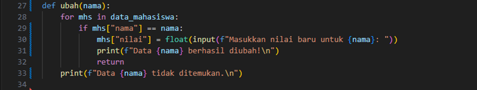
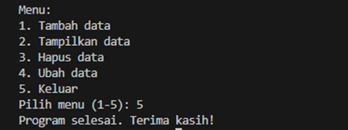

# Program sederhana dengan mengaplikasikan penggunaan fungsi yang akan menampilkan daftar nilai mahasiswa

### Contoh kode program sederhana Python3 (Vs Code)

**Penjelasan program:**
1.	**tambah():**

 * Meminta pengguna untuk memasukkan nama dan nilai mahasiswa.
 * Data yang dimasukkan disimpan dalam bentuk dictionary di dalam daftar data_mahasiswa.
2.	**tampilkan():**

 * Memeriksa apakah daftar data_mahasiswa kosong.
 * Jika ada data, menampilkan semua nama dan nilai mahasiswa secara berurutan.
3.	**hapus():**

 * Meminta pengguna memasukkan nama mahasiswa yang ingin dihapus.
 * Mencari data berdasarkan nama (tidak sensitif terhadap huruf besar/kecil).
 * Jika ditemukan, data akan dihapus; jika tidak, menampilkan pesan bahwa data tidak ditemukan.
4.	**ubah():**

 * Meminta pengguna memasukkan nama mahasiswa yang nilainya ingin diubah.
 * Jika data ditemukan, meminta nilai baru dan memperbaruinya.
 * Jika tidak ditemukan, menampilkan pesan bahwa data tidak ditemukan.
5.	**menu():**

* Menyediakan menu interaktif untuk pengguna:
     - 1: Tambah data.
     - 2: Tampilkan semua data.
     - 3: Hapus data berdasarkan nama.
     - 4: Ubah data berdasarkan nama.
     - 5: Keluar dari program.
* Input pengguna menentukan fungsi mana yang akan dijalankan.
* Mengulangi menu hingga pengguna memilih untuk keluar.

### Contoh Input & Output penggunaan

1.	**Menambahkan Data**

 * Menu ini digunakan untuk menambahkan data mahasiswa.
 * Langkah-langkah:
     - Pilih menu dengan mengetik 1 lalu tekan Enter.
     - Masukkan Nama mahasiswa (contoh: Andi).
     - Masukkan Nilai Tugas (contoh: 80).
     - Data akan disimpan, dan pesan "Data ditambahkan." akan muncul.

2.	**Tampilakan Data**

 * Menu ini digunakan untuk melihat semua data mahasiswa.
 * Langkah-langkah:
     - Pilih menu dengan mengetik 2, lalu tekan Enter.
     - Urutan ditampilkan:
         - Jika ada data, urutan berisi data nilai mahasiswa.
         - Jika tidak ada data, akan ditampilkan dengan pesan "TIDAK ADA DATA".

3.	**Hapus Data**

 * Menu ini digunakan untuk menghapus data mahasiswa berdasarkan nama.
 * Langkah-langkah:
     - Pilih menu dengan mengetik 3, lalu tekan Enter.
     - Masukkan nama mahasiswa yang ingin dihapus.
         - Jika data ditemukan, data akan dihapus, dan pesan "Data dihapus." akan muncul.
         - Jika data tidak ditemukan, pesan "Data tidak ditemukan." akan muncul.

4.	**Ubah Data**

* Menu ini digunakan untuk mengubah data nilai mahasiswa yang sudah ada.
* Langkah-langkah:
     - Pilih menu dengan mengetik 4, lalu tekan Enter.
     - Masukkan nama mahasiswa yang ingin diubah.
         - Jika data ditemukan, Anda akan diminta memasukkan data nilai baru.
         - Jika data tidak ditemukan, pesan "Data tidak ditemukan." akan muncul.
     - Setelah data diperbarui, pesan "Data diubah." akan muncul.

5.	**Keluar**

* Menu ini digunakan untuk keluar dari program.
* Langkah-langkah:
     - Pilih menu dengan mengetik 5, lalu tekan Enter.
     - Program akan menampilkan pesan "Selesai." dan berhenti berjalan.

### Flowchart 

**Penjelasan flowchart:**
1.	**Mulai Program:**
     * Program dimulai dengan menampilkan menu utama.
2.	**Menu Utama:**
     * Pengguna memilih salah satu dari lima opsi:
         1.	Tambah Data: Fungsi tambah() dipanggil untuk memasukkan data baru ke dalam daftar.
         2.	Tampilkan Data: Fungsi tampilkan() dipanggil untuk menampilkan semua data yang ada.
         3.	Hapus Data: Fungsi hapus(nama) dipanggil dengan parameter nama mahasiswa untuk menghapus data tertentu.
         4.	Ubah Data: Fungsi ubah(nama) dipanggil dengan parameter nama mahasiswa untuk memperbarui nilai mahasiswa.
         5.	Keluar: Program berhenti jika pengguna memilih opsi ini.
3.	**Operasi Berdasarkan Pilihan:**
     * Jika pilihan tidak valid, program meminta input ulang.
4.	**Selesai:**

